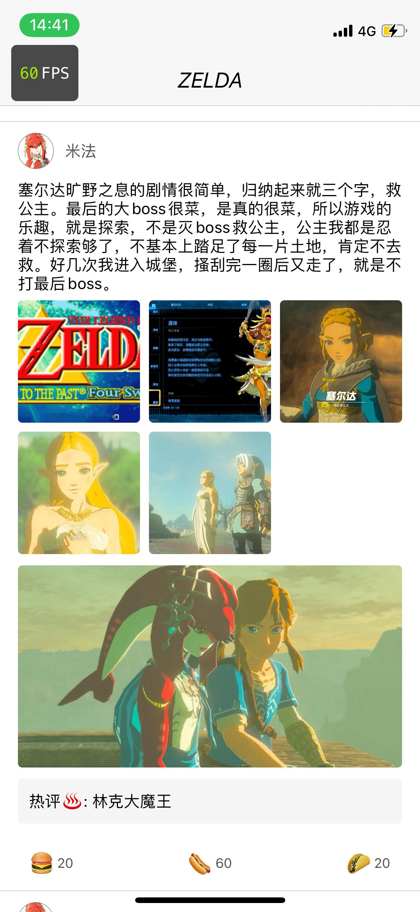

### YPPCubeTable
feed 流基本上是社交业务场景的标配了, 随着多年玩法的迭代, feed 流可以说是 app 里代码最复杂
的模块之一, 传统的 tableview 做法是这样的

1. 定义各种 cell 类型, 一般会搭配一个 cellViewModel
2. 为了滑动流畅, 一般会在 cellViewModel 中提前算好高度

上面这种做法, 在普通复杂度的业务面前没有任何问题, 但是如果要做一个类似于微博这样的 feed 流, 我们
会面临如下问题

1. 如何判断该不该生成一个新的 cell 类型<br>
假设我们有一个 cell 类型是这样的
header-文字-footer
这时来了新的业务, 要求发文字的同时也可以加图片, 那么 cell 里元素就是
header-文字-图片-footer
这时候该不该增加一个新的 cell 类型呢, 如果不增加, 那么很有可能随着业务迭代
这个 cell 的代码变得非常臃肿, 如果增加, 那么代码重复太多了, 如果要求统一更改某个
样式, 岂不是要改很多文件

2. 高度计算和布局的问题<br>
假设我们已经有一个很复杂的 cell, 里面的元素可能是这样<br>
header-文字-视频-图片-热评-活动连接-footer<br>
里面除了 header 和 footer 是固定的之外, 其他的元素都要根据数据显示或隐藏, 那我们高度计算的代码可能
是这样

```
    if (文字) {
        height += 文字高度
    }
    if (视频) {
        height += 视频高度
    }
    if (图片) {
        height += 图片高度
    }
    ...
```
cell 里面的布局代码可能是这样的

```
    文字.top = 0;
    图片.top = (文字 ? 文字.height : 0)
    视频.top = (文字 ? 文字.height : 0) + (图片 ? 图片.height : 0)
    热评.top = (文字 ? 文字.height : 0) + (图片 ? 图片.height : 0) + (视频 ? 视频.height : 0)
    活动链接.top = (文字 ? 文字.height : 0) + (图片 ? 图片.height : 0) + (视频 ? 视频.height : 0) + (热评 ? 热评.height : 0)
    ...
```
不要笑哦, 很多面试造火箭的公司, 承接百万日活的 feed 流场景, 代码就是这样的, 可能还不如这个

3. 开发效率的问题<br>
 可以看到, 传统的写法没有办法同时上很多人力, 假如要求三天内上一个很复杂的业务,
最后合并代码的时候可以想到那个酸爽.

YPPCubeTable, 一个可以完美解决上述问题的 feed 流框架. 按照框架规范, 您可以轻而易举的达到如下效果

1. 不需要再关心布局问题, 一行布局代码都不用写
2. 由代码自己生成最高效的 cell 类型
3. 非常优异的性能, 全程满帧滑动
4. 非常适合多人协作, 只要有人, 就可以快速参与开发, 甚至不需要熟悉业务

先看效果, 全程 60 帧滑动, 测试设备, iphone 12 mini


其中最复杂的 cell 类型如下



由 header-文字-图片-视频-热评-footer 组成<br>
其他的 cell 都是这个 cell 的子集 (当然 YPPCubeTable 也支持各自完全不同的 cell 类型)

cell 布局由一个一个的 cube 组成, 顺序定义在 cellViewModel
```
- (NSArray<Class> *)cubeRenderModelIndexList {
    return @[
        LGHeaderCubeRenderModel.class,
        LGArticleCubeRenderModel.class,
        LGPicCubeRenderModel.class,
        LGVideoCubeRenderModel.class,
        LGHotCommentCubeRenderModel.class,
        LGBottomCubeRenderModel.class
    ];
}

```

cubeRenderModel 负责转换数据, 计算高度. 
> 对 Cube 概念不熟悉的同学可以先看这里 [YPPCube](https://github.com/Luyakus/YPPCube)

cell 根布局是一个竖向布局容器, 把 cubeRenderModel 对应的 cube, 按照 cubeRenderModel 算出的高度, 竖向排列在 cell 上, cellViewlModel 会把 cubeRenderModel 算出的高度加起来, 作为 cell 的高度,由于我们提前算好了高度, 所以滑动时的性能不会差

至于如何在运行时决定最合适的 cell 类型, 是由 cubeCellLayout 辅助完成的.

1. cellViewModel 在获得数据时询问自己的 cubeRenderModel 能不能把对应的 cube 渲染出来, 然后把能渲染出来的 cube 的 class 生成 cubeCellLayout, 作为当前 cell 的 reuseIdentifier.
2. 当 cell 重用时, 会比对需要创建的 cell 的 cubeCellLayout 和已经有的 cubeCellLayout, 如果有能匹配上的, 就使用这个 cubeCellLayout, 然后把对应的 cell 进行重用. 核心代码如下

1. 发生重用
```objc
- (UITableViewCell *)tableView:(UITableView *)tableView cellForRowAtIndexPath:(NSIndexPath *)indexPath {
    LGFeedListCellVM *cvm = self.vm.cvms[indexPath.row];
    YPPCubeTableViewCell *cell = [YPPCubeTableViewCell dequeForTableView:tableView withLayout:cvm.layout];
    cell.selectionStyle = UITableViewCellSelectionStyleNone;
    [cell bindViewModel:cvm];
    return cell;
}
```

2. 根据 layout 设置 cube
```ojbc
@implementation YPPCubeTableViewCell

- (instancetype)initWithStyle:(UITableViewCellStyle)style reuseIdentifier:(NSString *)reuseIdentifier {
    if (self = [super initWithStyle:style reuseIdentifier:reuseIdentifier]) {
        self.layout = [YPPCubeCellLayout layoutForIdentifier:reuseIdentifier];
        self.groupCube = [[YPPCellGroupCube alloc] initWithData:self.layout.cubes];
        [self.groupCube setupView:self.contentView];
    }
    return self;
}

- (void)bindViewModel:(YPPCubeCellViewModel *)model {
    [self.groupCube.cubes enumerateObjectsUsingBlock:^(YPPCube * _Nonnull obj, NSUInteger idx, BOOL * _Nonnull stop) {
        // 取出 cubeRenderModel, 让对应的 cube 渲染
        [obj fillData:[model dataForTargetCube:NSStringFromClass(obj.class)]];
        [obj reload];
    }];
}
@end
```

3. 核心重用逻辑
```objc
+ (__kindof YPPCubeTableViewCell *)dequeForTableView:(UITableView *)tableView withLayout:(YPPCubeCellLayout *)layout {
    YPPCubeTableViewCell *cell = [tableView dequeueReusableCellWithIdentifier:layout.identifier];
    if (!cell) {
        YPPCubeCellLayout *cacheLayout = nil;
        for (YPPCubeCellLayout *regisitedLayout in tableView.regisitedLayouts) {
            // cube 数量相差超过 2 时, 不重用, 认为重用布局代价过高
            if (regisitedLayout.cubes.count - layout.cubes.count > 2) continue;
            // 内部算法判断是否可以重用
            if (![regisitedLayout coverOtherLayout:layout]) continue;
            cacheLayout = regisitedLayout;
            break;
        }
        // 没有找到可以复用的 cell
        if (!cacheLayout) {
            // 注册新的 cell 类型
            [tableView registerClass:self.class forCellReuseIdentifier:layout.identifier];
            // 保存 layout
            [tableView.regisitedLayouts addObject:layout];
            // 把已有的 layout 排序, 使下次重用时, 找到的 cell 是与创建的 cell 差异最小的
            [tableView.regisitedLayouts sortUsingComparator:^NSComparisonResult(YPPCubeCellLayout *obj1, YPPCubeCellLayout *obj2) {
                return obj1.cubes.count - obj2.cubes.count;
            }];
            cacheLayout = layout;
            NSLog(@"%@", layout.identifier);
        }
        cell = [tableView dequeueReusableCellWithIdentifier:cacheLayout.identifier];
    }
    return cell;
}

@end
```
列表中实际渲染的 cell 类型是上面的实际渲染的最复杂 cell 的任意子集, 其中 header, 文字, footer 是固定元素, 图片, 视频, 热评是可选元素,
所以实际类型有 C31 + C32 + C33 + 1 = 8 种
代码运行时, 实际创建的 cubeCellLayout 只有 4 中 (根据实际数据决定)
```
LGHeaderCube-LGArticleCube-LGHotCommentCube-LGBottomCube
LGHeaderCube-LGArticleCube-LGPicCube-LGHotCommentCube-LGBottomCube
LGHeaderCube-LGArticleCube-LGVideoCube-LGHotCommentCube-LGBottomCube
LGHeaderCube-LGArticleCube-LGPicCube-LGVideoCube-LGHotCommentCube-LGBottomCube
```
可以看到, 在 YPPCubeTable 的帮助下, 我们既可以获得非常好的性能, 又可以解决传统写法所面临的问题.

一个负责文字渲染的 cube 代码如下<br>
每个 cube 只负责自己的区域, 更改这个 cube 的代码不会影响其他的 cube. 想增加新的区域也只用新增一个 cube, 
然后在 cellViewModel 声明一下. 这些特性非常有利于多人协同开发, 非常适合大团队大业务作战.

```objc
@interface LGArticleCube()
@property (nonatomic, strong) UILabel *articleLab;
@property (nonatomic, weak) LGArticleCubeRenderModel *data;

@end

@implementation LGArticleCube
- (void)setupView:(UIView *)view {
    [super setupView:view];
    [view addSubview:self.articleLab];
    [self.articleLab mas_makeConstraints:^(MASConstraintMaker *make) {
        make.left.equalTo(view).offset(16);
        make.right.equalTo(view).offset(-16);
        make.top.equalTo(view).offset(10);
    }];
}

- (void)fillData:(LGArticleCubeRenderModel *)data {
    [super fillData:data];
    self.data = data;
    self.articleLab.attributedText = data.article;
}

- (CGFloat)cubeHeight {
    return self.data.cubeHeight;
}

- (UILabel *)articleLab {
    if (_articleLab) return _articleLab;
    _articleLab = [UILabel new];
    _articleLab.numberOfLines = 0;
    return _articleLab;
}

@end

@implementation LGArticleCubeRenderModel

- (NSString *)targetCube {
    return NSStringFromClass(LGArticleCube.class);
}

+ (instancetype)rendModelForData:(LGFeedItemModel *)data {
    if (data.article.length <= 0) return nil;
    LGArticleCubeRenderModel *rm = [LGArticleCubeRenderModel new];
    NSMutableAttributedString *attr = [[NSMutableAttributedString alloc] initWithString:data.article];
    attr.yy_font = [UIFont systemFontOfSize:14];
    attr.yy_color = UIColor.blackColor;
    YYTextLayout *layout = [YYTextLayout layoutWithContainerSize:CGSizeMake(UIScreen.mainScreen.bounds.size.width - 32, CGFLOAT_MAX) text:attr];
    
    rm.article = attr;
    rm.cubeHeight = layout.textBoundingSize.height + 10;
    return rm;
}

@end

```
最后 YPPCubeTable 还非常贴心的给出了通信方案, cube 中的事件, 可以分方便的发送到 cellViewModel 中处理, 一个图片 cube 的例子如下

```objc
// 图片cube 接收数据, 生成 9 宫格
- (void)fillData:(LGPicCubeRenderModel *)data {
    [super fillData:data];
    self.data = data;
    [self.holder.subviews makeObjectsPerformSelector:@selector(removeFromSuperview)];
    [data.pics enumerateObjectsUsingBlock:^(NSString * _Nonnull obj, NSUInteger idx, BOOL * _Nonnull stop) {
        NSInteger rowIndex = idx / KColumnCount;
        NSInteger columnIndex = idx % KColumnCount;
        CGRect rect = CGRectMake((KImageWidth + KSpace) * columnIndex, (KImageWidth + KSpace) * rowIndex, KImageWidth, KImageWidth);
        UIImageView *imageView = [[UIImageView alloc] initWithFrame:rect];
        imageView.layer.cornerRadius = 4;
        imageView.layer.masksToBounds = YES;
        imageView.contentMode = UIViewContentModeScaleAspectFill;
        [self.holder addSubview:imageView];
        [imageView yy_setImageWithURL:[NSURL URLWithString:obj] placeholder:nil];
        @weakify(self)
        // 发送点击事件
        [imageView setAction:^{
            @strongify(self)
            YPPCellCubeAction *action = [YPPCellCubeAction new];
            action.from = NSStringFromClass(self.class);
            action.type = @"pickClick";
            action.data = @(idx);
            [self.data.passOut sendNext:action];
        }];
    }];
}

// cellViewModel 中接收
- (void)responseAction:(YPPCellCubeAction *)action {
    NSLog(@"%@-%@-%@", action.from, action.type, action.data);
}
```

通过这个小小的 demo, 相信大家已经感受到了 YPPCubeTable 的方便与快捷.
YPPCubeTable 是经过充分验证的 Feed 流企业级解决方案, 希望它能帮助大家构建高质量的应用

